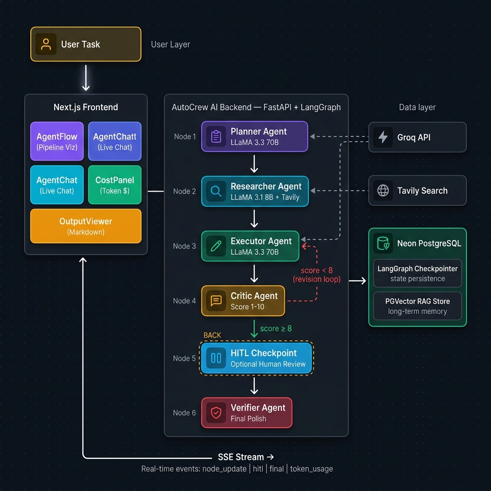

# AutoCrew AI 🤖

A **production-ready, hierarchical multi-agent automation platform** powered by LangGraph, Groq LLMs, and Neon Serverless PostgreSQL. AutoCrew deploys a crew of five specialist AI agents that collaborate autonomously to research, write, critique, and deliver publication-quality output — with real-time streaming, human-in-the-loop control, long-term memory (RAG), and token cost tracking.

---

## ✨ Key Features

| Feature | Description |
|---|---|
| 🤖 **5-Agent Pipeline** | Planner → Researcher → Executor → Critic → Verifier |
| 🔄 **Self-Critique Loop** | Critic scores drafts (1–10); Executor revises until threshold met |
| 👤 **Human-in-the-Loop (HITL)** | Pause, review, approve or request revisions before final output |
| 🧠 **Long-Term Memory (RAG)** | PGVector stores past task summaries; similar memories auto-injected |
| 💰 **Token Cost Tracking** | Per-agent token usage & real-time USD cost estimate |
| 💬 **Chat-style Agent Console** | Live agent collaboration shown as styled chat bubbles |
| 📡 **Real-time Streaming (SSE)** | Watch agents work live via Server-Sent Events |
| 🐘 **Persistent State** | LangGraph checkpoints stored in Neon PostgreSQL |
| 🔍 **Web Research** | Tavily-powered multi-query web search via Researcher agent |

---

## 🏗️ Architecture



> **Flow:** User submits a task → Planner decomposes it → Researcher gathers data → Executor drafts content → Critic scores and loops back if quality is below threshold → (Optional) HITL pause for human review → Verifier polishes final output → stored in long-term RAG memory.

```
Planner → Researcher → Executor ←──────────────┐
                           │                    │ score < 8
                        Critic ─────────────────┘
                           │ score ≥ 8
                      [HITL Checkpoint]   ← optional pause
                           │
                        Verifier → Final Output → PGVector Memory
```

---

## 🗂️ Project Structure

```
AutoCrew AI/
├── backend/
│   ├── app/
│   │   ├── agents/
│   │   │   ├── base.py          # BaseAgent (token tracking, structured output)
│   │   │   ├── planner.py       # PlannerAgent
│   │   │   ├── researcher.py    # ResearcherAgent (Tavily search)
│   │   │   ├── executor.py      # ExecutorAgent (content creation)
│   │   │   ├── critic.py        # CriticAgent (scoring & feedback)
│   │   │   └── verifier.py      # VerifierAgent (final polish)
│   │   ├── graph/
│   │   │   └── workflow.py      # LangGraph StateGraph (full pipeline)
│   │   ├── services/
│   │   │   ├── task_service.py  # SSE streaming orchestration
│   │   │   └── memory_service.py # RAG long-term memory (PGVector)
│   │   ├── schemas/
│   │   │   └── state.py         # AgentState TypedDict
│   │   ├── core/
│   │   │   ├── config.py        # Pydantic settings
│   │   │   └── database.py      # Async SQLAlchemy + Neon
│   │   └── main.py              # FastAPI app + all endpoints
│   └── requirements.txt
│
├── frontend/
│   ├── app/
│   │   ├── page.tsx             # Landing / Hero page
│   │   ├── tasks/
│   │   │   ├── new/page.tsx     # Task submission form
│   │   │   └── [id]/page.tsx    # Live task progress page
│   ├── components/
│   │   ├── AgentFlow.tsx        # Pipeline step visualizer
│   │   ├── AgentChat.tsx        # Chat-style agent console
│   │   ├── CostPanel.tsx        # Token usage & cost tracker
│   │   ├── OutputViewer.tsx     # Markdown output renderer
│   │   ├── TaskForm.tsx         # Task submission form
│   │   └── Navbar.tsx
│   └── lib/
│       └── api.ts               # Typed API client + SSE stream helpers
│
└── docker-compose.yml           # Backend Docker setup
```

---

## 🚀 Tech Stack

| Layer | Technology |
|---|---|
| **Backend Framework** | FastAPI + uvicorn |
| **Agent Orchestration** | LangGraph (StateGraph, HITL interrupts, checkpointing) |
| **LLM** | Groq (Llama 3.3 70B + Llama 3.1 8B Instant) |
| **Web Research** | Tavily Search API |
| **Database** | Neon Serverless PostgreSQL |
| **Vector Store / RAG** | pgvector + langchain-postgres + all-MiniLM-L6-v2 embeddings |
| **Checkpointing** | AsyncPostgresSaver (LangGraph) |
| **Streaming** | Server-Sent Events (SSE) via sse-starlette |
| **Frontend** | Next.js 14 + TailwindCSS |
| **Observability** | LangSmith tracing |

---

## ⚙️ Getting Started

### Prerequisites
- Python 3.11+
- Node.js 18+
- A [Neon](https://neon.tech) PostgreSQL database (free tier works)
- A [Groq](https://console.groq.com) API key
- (Optional) A [Tavily](https://tavily.com) API key for web research

### 1. Clone & configure

```bash
git clone https://github.com/chiranthanHY/AutoCrew-AI.git
cd AutoCrew-AI
```

Copy the example env file and fill in your keys:

```bash
cp .env.example .env
# Edit .env with your GROQ_API_KEY, DATABASE_URL (Neon), TAVILY_API_KEY
```

### 2. Backend setup

```bash
cd backend
python -m venv .venv
.venv\Scripts\activate        # Windows
# source .venv/bin/activate   # Mac/Linux

pip install -r requirements.txt
uvicorn app.main:app --reload
```

Backend runs at: **http://localhost:8000**
API docs: **http://localhost:8000/api/docs**

### 3. Frontend setup

```bash
cd frontend
npm install
npm run dev
```

Frontend runs at: **http://localhost:3000**

---

## 🔌 API Endpoints

| Method | Endpoint | Description |
|---|---|---|
| `GET` | `/health` | Service & DB health check |
| `POST` | `/tasks/run` | Run a task (streaming SSE or blocking) |
| `POST` | `/tasks/{id}/resume` | Resume a HITL-paused task |
| `GET` | `/tasks/{id}/state` | Get persisted task state |
| `GET` | `/tasks/{id}/history` | LangGraph checkpoint history |
| `GET` | `/memory` | List long-term RAG memories |
| `GET` | `/api/docs` | Swagger UI |

---

## 🧠 Long-Term Memory (RAG)

Every completed task is automatically stored as a vector embedding in Neon using `pgvector`. On subsequent runs, the system retrieves the top-3 most semantically similar past tasks and injects them as context into the Executor agent — giving the crew persistent **institutional memory** that improves output quality over time.

---

## 💰 Token Cost Tracking

AutoCrew tracks token usage for every agent call using Groq's response metadata. The frontend displays a real-time cost breakdown per agent with estimated USD cost based on Groq's public pricing for Llama 3.3 70B and Llama 3.1 8B.

---

## 🐳 Docker

```bash
# Start backend only (uses Neon for DB)
docker-compose up backend

# Or build fresh
docker-compose up --build
```

---

## 📄 License

MIT License — see [LICENSE](LICENSE) for details.


https://github.com/user-attachments/assets/c5ff2fc5-7c0b-4f4a-8717-0cc2d4a900f9


